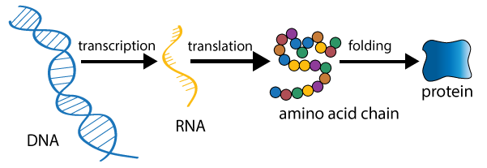
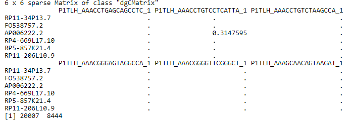
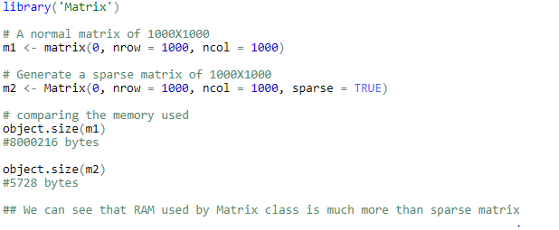
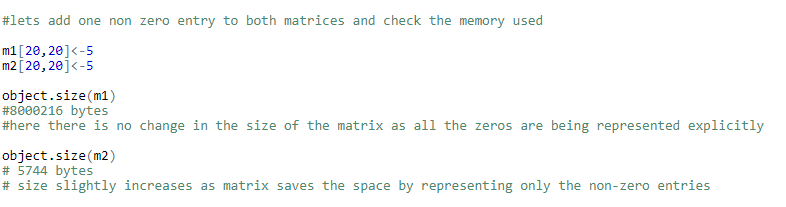

```{r, include=FALSE}
options(tinytex.verbose = TRUE)
```

#INTRODUCTION

## Purpose and Motivation
 Cell is the basic structural unit of life and human body is made up of millions of cells which are responsible for carrying out various functions and life processes. With time, these processes in the human body begin to depreciate and become inefficient, thereby causing sickness and impacting the health of human beings. Therefore, it is important to study and analyse various aspects of human body to keep human population healthy and make it resistant to diseases.<br/>
  
 In early centuries, the health care system was more of a sick-cure system where a person was cured once he got any illness. With advancement in healthcare and medicine this approach has now been shifted to detect the cause of underlying disease instead to make our health care system disease proof. Identification of senescence-associated transcriptional profiles is one such example.   
    
 This thesis involves the analysis of two RNA sequencing datasets namely liver and bone marrow. This project aims to reduce the number of genes with the help of various dimensionality reduction techniques, to find differentially expressed genes and thus investigating the genes that are associated with cellular senescence.The scope of the project also extends to perform gene co-expression analysis to find which genes are correlated with those differentially expressed genes. Differential gene expression analysis is also carried out to test if there are any significant differences in gene expressions between different conditions.

****Describe one line about each chapter

##Biological Background 

We all know that cell is the basic structural unit of all living organisms and human body consists of trillions of cells, and these cells have specialised functions which are responsible for healthy functioning of different organs. The nucleus of cell contains sub-cellular structures known as chromosomes which are responsible for transferring genetic material. Each chromosome has tightly packed DNA. Information stored in DNA is used to synthesize a protein which is responsible for functioning of a cell. Gene is a part of DNA on chromosome which is transcribed to RNA, which is then translated to amino acids which get folded to synthesise proteins. This process of synthesizing proteins from DNA is known as gene expression [@crick1970central] .

```{r,echo=FALSE, fig.align='center', fig.width=0.5, fig.cap="Gene Expression-Conversion of DNA to Protein"}




```
Note: This image has been downloaded from:http://bio.academany.org/2017/labs/BioRiiDL_2017/sreejith/images/assignments/dogma.png<br/>

The knowledge of gene expression helps us to find and target various problems in human body as mutation of cells cause diseases and we can study the difference in normal and mutated cells by their gene expression. 
  
Cells can accomplish diverse functions with identical DNA in part by controlling the quantity of RNA which is produced from each gene. For example, although cells throughout the human body have essentially the same DNA, of all genes only some specific genes are turned on which leads to different appearances of the cell [@schug2005promoter], thereby allowing tissues to perform diverse functions.

The activity of thousands of genes is measured at once to create a global picture of functioning in cells. This is known as expression profiling [@metsis2004whole]. This is done to find out which cells are actively dividing or how these cells are reacting to a treatment. The data required for carrying out such analysis is generated using various Transcriptomics technologies[@lowe2017transcriptomics] like DNA-Microarrays and RNA-Sequencing. In this project, we will be using RNA-Sequencing data for analysing the genes associated with cellular senescence.

Cellular senescence is the phenomenon associated with ageing of cells due to which cells are no longer able to divide and this can occur because of damaged DNA [@hayflick1961serial].Normal cells in our body grow,repair,replicate and die whereas senescent cells cease to divide and often lead to loss of function and are found in organs with chronic diseases.Study of senescent cells is an undiscovered and fascinating topic in the field of biotechnology and immunology as removal of senescent cells from the human body may slow down or reverse ageing [@de2017fountain]. Presence of senescent cells when tested on mice lead to physical dysfunction whereas the removal of these cells extended their lifespan and restored health [@pan2017inhibition]. 


##Dataset Description and availability

The datasets used in this project are generated using scRNA-Seq. ScRNA is a detailed study if geneexpression as it tries to capture the activity of thousands of genes in a single cell.It has provided a lot of useful insights in the field of cancer genomics[@hwang2018single] and is a new domain with ongoing research.Sc RNA-seq is used to study functions of a cell and its heterogeneity [@papalexi2018single].It treats each cell like an individual sample. A gene expression matrix obtained after sc RNA with genes as rows (features) and cells as columns (cases).Each row in matrix gives counts per sample for a specific gene.
The reads matrix obtained after RNA-Seq are filtered and pre-processed (refer Chapter 3), and once the data is filtered the gene expression matrix is normalised to make data comparable and to prevent false biological conclusions [@steinhoff2006normalization].The two datasets in this project are liver and bone-marrow. The dataset provided for liver was already normalized whereas the dataset for bone-marrow data had raw-counts and was filtered and pre-processed for further analysis.

Biological matrices are represented differently than the matrices in statistics.These matrices are popularly known as count matrices or gene-expression matrices. Here the rows represent features and columns represent cases. Each cell in the matrix represents the number of reads mapping to each gene for each sample. These matrices usually have a lot of zeros, which can occur if data is not captured properly or a particular gene is not expressed in that cell.

The table 1.1 represents the layout of the Gene Expression matrix.This is a fake data matrix for illustration purposes.

```{r, echo=FALSE}


exp_mat<-data.frame("Genes"=c("Gene 1", "Gene 2","Gene 3","Gene 4"),
                    "Sample 1"=c(1,0,0,1),
                    "Sample 2"=c(0,0,1,0))

knitr::kable(
  exp_mat, booktabs = TRUE,
  caption = 'Sample Gene expression matrix'
)

```


LIVER Dataset:  
The dataset contains gene expression profiling of 8444 cells obtained from liver grafts of five healthy neurologically deceased donors (NDD).The data acquired is a 20007 X 8444 matrix with 20007 genes and 8444 cells.  
The liver dataset used for analysis can be downloaded from : 
https://www.ncbi.nlm.nih.gov/geo/query/acc.cgi?acc=GSE115469ty 


```{r ,echo=FALSE, fig.align='center', fig.width=0.5, fig.cap="First five rows and columns of the liver dataset"}



```

Bone-Marrow Dataset:</br>
The bone marrow dataset is obtained from twenty volunteers, that is, 10 males and 10 females with ages ranging from 24 to 84 years old and median age of 57 years. The scRNA-Seq (single cell RNA- Sequencing) was performed using 10X Genomics Single Cell 3 Solution, version 2. Files from multiple donors were merged to obtain the gene-expression matrix with row counts and the dimensions of the matrix thus obtained were 33694 X 90653 and a seurat object was created \@ref{Outline of Bioconductor Ecosystem}. The dataset has 33694 genes and 90653 cells which will be pre-processed and filtered for analysis.  
The bone-marrow dataset used for analysis can be downloaded from : 
https://www.ncbi.nlm.nih.gov/geo/query/acc.cgi?acc=GSE120221


```{r ,echo=FALSE, fig.align='center', fig.width=0.5, fig.cap="Seurat object created from gene-expression matrix of bone-marrow dataset"}

knitr::include_graphics("bmobject.png")

```

###Challenges with Datasets:
The scRNA data is recorded at a single cell resolution, thus the size of the count matrices may vary from The matrices used to store biological information are large and working with these datasets is computationally exhaustive. Therefore it is important to have good computational power to carry out analysis using these datasets.To make it easier to work with these datasets the information is stored using sparse matrices. (?reference)

###Sparse Matrices
The matrices obtained from biological data are usually big and have many zeros. Sparse matrices 5 are used when most of the elements in the dataset are 0. Sparse Matrix saves a lot of space in the memory by representing only the non-zero entries. It is computationally efficient compared to the dense matrices and makes calculations faster. A matrix is called dense when most of the elements in the matrix are non-zero. The below example has been created using R [R] to understand the advantages of sparse matrices compared to dense matrices.

```{r ,echo=FALSE, fig.align='center', fig.width=0.5, fig.cap="Memory used in sparse and normal matrices"}




```

If we add a single non-zero observation to the dataset we can clearly see that space in memory occupied by the sparse matrix will increase while the space occupied by the normal matrix will remain unchanged. 

```{r,echo=FALSE, fig.align='center', fig.width=0.5, fig.cap="Storage space for Sparse Matrices increase as they store the non-zero elements"}



```


Both the datasets in this project have been stored as sparse matrix for the ease of calculations. 

##RNA-Sequencing Workflow

A typical RNA-Seq analysis consists of five steps. There are variety of softwares and environments that can be used in the analysis of RNA-Seq data, however the steps taken in an analysis workflow are typically analogous and will follow the same procedure as discussed in this project. The stages in the workflow are pre-processing of raw counts, normalization, Dimensionality Reduction, Clustering and Labelling, Differential Expression Analysis and Pathway Enrichment Analysis.Figure \footnote{This image has been downloaded from \url{https://www.nature.com/articles/s41467-018-06318-7}[@macparland2018single]} \ref{fig:rs} describes the workflow commonly used for analysing RNA-Seq Data.

\begin{figure}[H]
  \includegraphics[scale=0.8]{rna-work.png}
  \caption{RNA-Seq Workflow}
  \label{fig:rs}
\end{figure}  


The raw counts in the dataset are filtered to remove low quality and dying cells. The resultant matrix is them normalized to make data comparable and to prevent false biological conclusions[@steinhoff2006normalization]. Once, normalized matrix is achieved then analysis is performed. Dimensionality reduction techniques are used to reduce the number of genes (features) and to find out important features. This is done with the help of various techniques like Principal Component Analysis [@jolliffe2011principal], t-SNE [@maaten2008visualizing]. Then clustering is done on the results of PCA and the resultant clustered are labelled (refer chapter 4). The differentially expressed genes also known are marker genes are then located (refer chapter 4).

